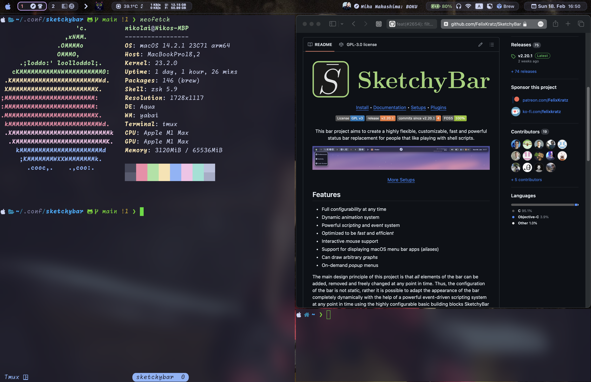

# [SketchyBar](https://github.com/FelixKratz/SketchyBar)

Sketchybar is a highly customisable tool for MacOS, acting as a replacement for the default system menu bar, it's very versatile and I'm starting to try it out recently. Here you can find my configuration files mainly written in shell.

Please feel free to clone if you want to try it out for yourself.

