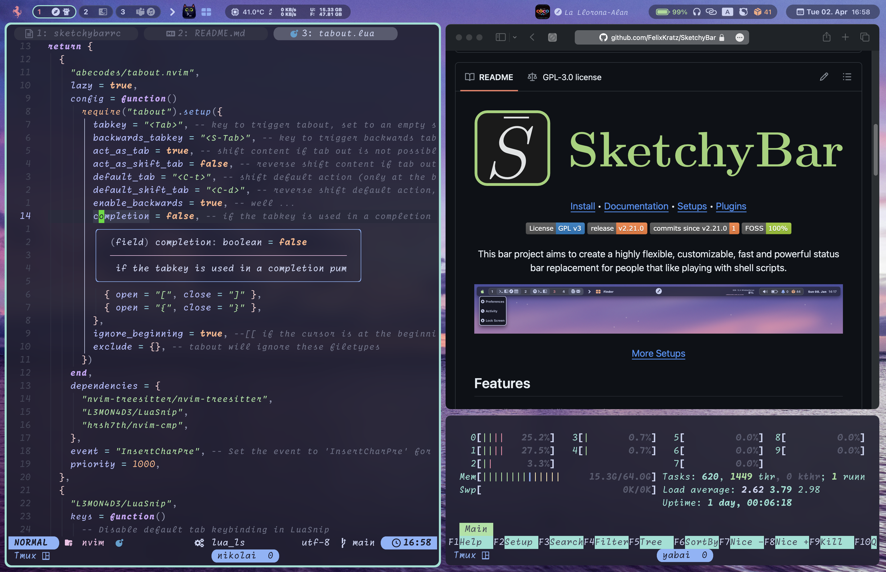

<!-- markdownlint-disable MD013 MD001 -->

# [SketchyBar](https://github.com/FelixKratz/SketchyBar)

Sketchybar is a highly customisable open source tool for MacOS, acting as a replacement for the default system menu bar, it's very versatile and I'm starting to try it out recently. Here you can find my configuration files mainly written in shell.

My setup as of right now is basically a merge of all the wonderful plugins that you can find on the thread of SketchyBar plus some minor tweaks, so thanks to all these awesome people.

Please feel free to clone if you want to try it out for yourself.

### Requirements

- [Homebrew](https://brew.sh)
- jq -> `brew install jq`
- Istat Menus -> `brew install --cask istat-menus`
- smctemp -> `brew install smctemp`
- [yabai](https://github.com/koekeishiya/yabai) -> `brew install yabai` - _optional_
- [skhd](https://github.com/koekeishiya/skhd) (yabai keybindings) -> `brew install skhd` - _optional_

### [Install](https://felixkratz.github.io/SketchyBar/setup)

- There is already a pretty detailed guide on how to install SketchyBar and its required dependencies, so please follow that.

### Tips

- For the music plugin, because I mostly use Apple Music and YouTube Music (_I know I know_), and luckily this plugin works for both. However, if you are like me, and have some personally imported music in apple music, and would still like to see the music info when it's playing, you can add the artist/album/title in the Music.app by clicking on a title and press Command+i to edit manually.
